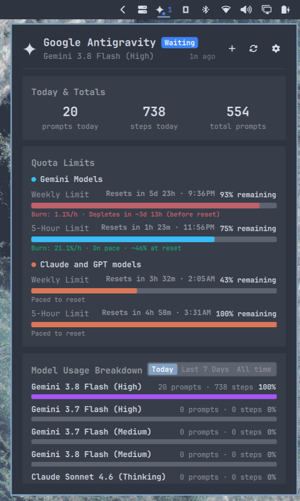

# Antigravity Usage for Omarchy

Antigravity active session monitor, prompt metrics, tool telemetry, interactive session launcher, and 7-day usage stats in the Omarchy top bar.



## Features

### 1. Status Bar Icon & Live Badge
- **Themed Vector Icon**: Clean 4-pointed sparkle icon dynamically colorized to match your active Omarchy theme foreground color via `MultiEffect`.
- **State Pulse Indicator**: Color-coded pulse dot indicating real-time agent activity:
  - 🟢 **Green (Pulsing)**: Agent is actively executing/thinking (`Working`).
  - 🔵 **Blue**: Session is open but waiting for user input (`Waiting`).
  - ⚪ **Transparent**: Idle (no active sessions).
- **Configurable Bar Badge Mode**: Dynamic badge pill with configurable display modes:
  - `active` (Default): Number of concurrent background sessions currently running (auto-hides when idle for a clean bar).
  - `prompts`: Total prompts executed today (auto-hides when 0).
  - `off`: Disables the badge completely for an ultra-minimal bar icon.
- **Detailed Tooltip**: Hovering the bar widget shows active session status, today's prompt count, and current model.

### 2. Interactive Session Management
- **Quick Terminal Resume**: Click any session card or press `1`–`5` to immediately resume that session in your terminal (`agy --conversation <id>`).
- **Terminal Emulator Override**: Configurable terminal command/binary override (e.g. `foot`, `ghostty`, `kitty`, `alacritty`, or custom command) with automatic working directory handoff, defaulting to `xdg-terminal-exec`.
- **New Session Launcher**: Click the `` header button or press `n` to launch a brand-new `agy` session in your chosen terminal.
- **Process Termination**: Hover over any running session and click the red `` button to terminate the session process cleanly (`SIGTERM`) and release its presence lock.
- **Configurable Recent Sessions**: Choose your preferred default display limit (3 to 10 sessions) with one-click expansion to view all recent sessions, complete with styled workspace tags (` <ws>`), step counters, and relative timestamps.

### 3. Model Usage Breakdown with Timeframe Toggle
- **Timeframe Switcher**: Interactive segmented pill toggle in the top-right corner to switch between:
  - **Today**: Prompt and step counts for the current calendar day.
  - **Last 7 Days**: Usage aggregated across the past week.
  - **All time**: All-time cumulative model usage.
- **Dynamic Sorting & Animated Visuals**: Models automatically re-sort by activity in the selected timeframe, and progress bars smoothly animate (`Easing.OutCubic`) to reflect proportional usage share.
- **Consistent Metrics**: Clean, uniform `X prompts · Y steps` formatting across all models and timeframes.

### 4. Quota Limits, Burn Rate & Desktop Alerts
- **Real-Time Quota Buckets**: Live quota information fetched from `agy /usage` (Gemini Weekly & 5-Hour limits, Claude/GPT Weekly & 5-Hour limits).
- **Burn Rate Velocity & Reset Forecasting**: Real-time hourly consumption tracking (`🔥 X%/h`) and intelligent reset pacing projections (`On pace · ~65% at reset` or early warnings `Depletes in ~2.0h before reset`).
- **Dual Reset Time Display**: Shows both relative countdown timers (e.g. `2h 15m`) and exact local wall-clock times (e.g. `04:15 AM`).
- **Configurable Low Quota Alerts**: Toggle desktop notifications on/off and configure custom remaining percentage thresholds (5% to 50%, default 15%) via `omarchy-notification-send` (with 2-hour per-bucket rate-limiting cooldown).

### 5. Performance & Telemetry
- **Sub-50ms High Performance**: Incremental transcript caching indexed by file modification time and size keeps full telemetry and session scans under ~50ms even with dozens of past sessions.
- **Decoupled Quota Fetching**: Telemetry and popup opens remain instantaneous while quota limits update asynchronously in the background.
- **Dynamic Configured Model**: Automatically detects default model selection from `~/.gemini/antigravity-cli/settings.json`.
- **Fast Inode PID Resolution**: O(1) advisory lock lookup via `/proc/locks` for instant session termination (`killSession`).
- **Adaptive Polling**: Automatically scales refresh frequency from 60s idle down to 10s when an active session is working, then returns to 60s when idle.
- **Today & Totals Summary**: Quick stats for prompts today, steps today, and cumulative total prompts.
- **7-Day Activity Chart**: Daily prompt activity visualization across the past week.
- **Tool Telemetry Breakdown**: Live call counters for tools (`run_command`, `write_to_file`, `replace_file_content`, `view_file`, `grep_search`, `find_by_name`, `subagents`, etc.).
- **Smart Presence & Lock Pruning**: High-speed responses with automatic pruning of unheld presence locks older than 48 hours.

### 6. Dual Omarchy Integration
- **Standalone Bar Widget**: Full-featured QML popup panel (`jesseburlamaque.antigravity-usage`).
- **Native Agents Panel Collector**: Includes companion binary (`bin/omarchy-agent-usage-antigravity`) compatible with Omarchy's system-wide `omarchy.agents` contract (`--limits-only`).

---

## Requirements

- Python 3 (standard library: `sqlite3`, `json`, `datetime`, `pathlib`, `collections`, `subprocess`, `shutil`, `fcntl`)
- Google Antigravity (`agy` CLI / IDE) with local session data in `~/.gemini/antigravity-cli`
- Omarchy Shell / Quickshell

---

## Installation

```sh
omarchy plugin add https://github.com/jesseburlamaque/antigravity-usage.git --enable
omarchy restart shell
```

### (Optional) Native `omarchy.agents` Panel Integration

To also include Antigravity as a tab inside Omarchy's built-in Agents panel:

```sh
mkdir -p ~/.local/bin
ln -sf ~/.config/omarchy/plugins/jesseburlamaque.antigravity-usage/bin/omarchy-agent-usage-antigravity ~/.local/bin/omarchy-agent-usage-antigravity
```

---

## Update

```sh
omarchy plugin update jesseburlamaque.antigravity-usage --yes
omarchy restart shell
```

---

## Removal

To remove the plugin from Omarchy:

```sh
omarchy plugin remove jesseburlamaque.antigravity-usage
omarchy restart shell
```

If you configured the optional Agents panel integration:

```sh
rm -f ~/.local/bin/omarchy-agent-usage-antigravity
```

---

## Interactions & Shortcuts

### Mouse Controls
- **Left Click**: Open/close popup panel.
- **Middle Click**: Force immediate telemetry and quota refresh.
- **Right Click**: Toggle in-popup settings view (or click the `` header button).

### Keyboard Shortcuts (when popup is open)
| Shortcut | Action |
|---|---|
| `1`–`5` | Quick-resume the corresponding recent session in terminal |
| `n` | Launch a new `agy` terminal session |
| `r` | Force refresh telemetry and quota limits |
| `s` | Toggle between Stats and Settings view (or save settings) |
| `j` / `k` | Scroll popup content down / up |
| `q` or `Esc` | Close popup panel |

### IPC Commands & Custom Keybindings

The widget registers an IPC target (`jesseburlamaque.antigravity-usage`), allowing compositor keybindings (e.g. Hyprland / Sway):

| Action | Command |
|---|---|
| Toggle popup | `omarchy-shell shell toggle jesseburlamaque.antigravity-usage` |
| Open popup | `omarchy-shell shell summon jesseburlamaque.antigravity-usage` |
| Close popup | `omarchy-shell shell hide jesseburlamaque.antigravity-usage` |
| Refresh telemetry | `omarchy-shell ipc call jesseburlamaque.antigravity-usage refresh` |
| Open settings | `omarchy-shell ipc call jesseburlamaque.antigravity-usage settings` |

---

## Configuration

Configuration lives in `~/.config/omarchy/shell.json` or can be adjusted directly in the widget's in-popup settings view (right-click or press `s`):

| Key | Type | Default | Description |
|---|---|---|---|
| `refreshIntervalSec` | integer (10–1800) | `60` | Telemetry refresh rate in seconds (adaptively scales to 10s when active) |
| `badgeMode` | enum (`active`, `prompts`, `off`) | `"active"` | Bar badge display mode (`active` sessions count, today's `prompts`, or disabled `off`) |
| `enableQuotaAlerts` | boolean | `true` | Send desktop notifications when model quota falls below threshold |
| `quotaAlertThreshold` | integer (5–50) | `15` | Low quota percentage alert threshold |
| `terminalCommand` | string | `""` | Terminal emulator command override (`foot`, `ghostty`, `kitty`, `alacritty`, or blank for `xdg-terminal-exec`) |
| `recentSessionsLimit` | integer (3–10) | `5` | Initial number of recent sessions to display before expanding |

---

## Development & Testing

Run the automated test suite verifying lock detection, plain-text sanitization, and telemetry schema contracts:

```sh
python3 -m unittest discover -s tests
```

---

## License

MIT © Jesse Burlamaque & contributors
